<p align="center">
  
</p>

<h3 align="center">Self-managing Kubernetes clusters with zero-trust networking</h3>

<p align="center">
  <a href="https://lattice-docs.vercel.app">
    
  </a>
</p>

---

## Why Lattice

Deploying a service on Kubernetes means writing a Deployment, Service, ServiceAccount, ScaledObject, PVC, ExternalSecret, NetworkPolicy, AuthorizationPolicy, Gateway, and HTTPRoute — then hoping they all agree with each other. Your management cluster is a single point of failure. Your network policies are allow-lists that nobody audits. Your secrets have no access control.

Lattice fixes all three problems: **one CRD per service**, **self-managing clusters**, and **Cedar policy authorization** for everything.

---

## LatticeService

LatticeService is a [Score](https://score.dev)-compatible superset that replaces the entire stack of Kubernetes resources for a service. Declare your containers, dependencies, secrets, and volumes in a single file — Lattice compiles it into everything your service needs with default-deny networking enforced automatically.

### One CRD, Everything Generated

```yaml
apiVersion: lattice.dev/v1alpha1
kind: LatticeService
metadata:
  name: api-gateway
  namespace: platform
spec:
  containers:
    main:
      image: myorg/api:v2.1.0
      variables:
        AUTH_URL: ${resources.auth-service.url}
        DB_PASS: ${resources.db-creds.password}
        CACHE_HOST: ${resources.redis.host}
      volumes:
        /data:
          source: "${resources.data}"

  service:
    ports:
      http:
        port: 8080

  resources:
    auth-service:
      type: service
      direction: outbound            # "I call auth-service"
    web-frontend:
      type: service
      direction: inbound             # "web-frontend can call me"
    db-creds:
      type: secret
      id: database/prod/creds
      params:
        provider: vault-prod
        keys: [username, password]
        refreshInterval: 1h
    data:
      type: volume
      params:
        size: 50Gi
        storageClass: fast-nvme

  replicas: 2
  autoscaling:
    max: 10
    metrics:
      - metric: cpu
        target: 80

  ingress:
    hosts:
      - api.example.com
    tls:
      mode: auto
      issuerRef:
        name: letsencrypt-prod

  deploy:
    strategy: canary
    canary:
      interval: 1m
      stepWeight: 10
      maxWeight: 50
      threshold: 5
```

Lattice compiles this into all the Kubernetes resources your service needs — handling **zero-trust networking**, **PKI & mTLS**, **secret management**, **autoscaling**, **ingress & TLS**, **storage**, and **deployment strategies** automatically.

### Score-Compatible `${...}` Templates

LatticeService follows the [Score](https://score.dev) specification for workload declaration, then extends it. The `${...}` placeholder syntax resolves resource references at compile time:

```yaml
variables:
  DB_HOST: "${resources.postgres.host}"          # Service endpoint
  DB_PASS: "${resources.db-creds.password}"      # Secret from Vault
  CLUSTER: "${cluster.name}"                     # Cluster metadata
  ENV: "${cluster.environment}"                  # Environment tag

files:
  /etc/config.yaml:
    content: |
      server:
        host: ${resources.api.hostname}
        port: ${resources.api.port}

volumes:
  /data:
    source: "${resources.storage}"               # Volume reference
```

### Resource Types

The `resources` block is where LatticeService becomes powerful. Every external dependency your service has — other services, secrets, volumes, GPUs — is declared here. Lattice uses these declarations to generate network policies, sync secrets, provision storage, and wire everything together.

**Service dependencies** — declare who you call and who calls you:

```yaml
resources:
  auth-service:
    type: service
    direction: outbound       # This service calls auth-service
  web-frontend:
    type: service
    direction: inbound        # web-frontend calls this service
  cache:
    type: service
    direction: both           # Bidirectional
```

**Secrets** — synced from Vault (or any ESO provider) with Cedar authorization:

```yaml
resources:
  db-creds:
    type: secret
    id: database/prod/credentials     # Vault path
    params:
      provider: vault-prod            # SecretProvider CRD
      keys: [username, password]      # Specific keys to sync
      refreshInterval: 1h             # Auto-refresh
      secretType: kubernetes.io/basic-auth
```

**Volumes** — owned or shared across services:

```yaml
resources:
  data:
    type: volume
    params:
      size: 100Gi                     # Has size = owner (creates PVC)
      storageClass: fast-nvme
      accessMode: ReadWriteOnce
  shared-media:
    type: volume
    id: media-library                 # No size = consumer (references existing PVC)
```

**GPUs** — full or fractional allocation:

```yaml
resources:
  accelerator:
    type: gpu
    params:
      count: 2
      memory: 8Gi                     # Per-GPU memory (enables fractional via HAMi)
      model: A100
```

### Bilateral Service Mesh

Service dependencies aren't just documentation — they're **enforced**. Traffic between services requires mutual consent. Both the caller and callee must declare the relationship or traffic is denied.

```
 api-gateway                        auth-service
 ┌─────────────────┐                ┌─────────────────┐
 │   auth-service:  │───────────────▶│   api-gateway:   │
 │     direction:   │   ALLOWED      │     direction:   │
 │       outbound   │                │       inbound    │
 └─────────────────┘                └─────────────────┘

 api-gateway                        payment-service
 ┌─────────────────┐                ┌─────────────────┐
 │   payment-svc:   │───────X───────▶│ (no declaration) │
 │     direction:   │   DENIED       │                  │
 │       outbound   │                │                  │
 └─────────────────┘                └─────────────────┘
```

Enforced at two layers simultaneously: **Cilium L4 eBPF** + **Istio L7 mTLS**. Remove either side's declaration and traffic stops immediately.

### Sidecars, Probes, and Security

LatticeService supports the full range of container configuration you'd expect — plus Lattice extensions:

```yaml
containers:
  main:
    image: app:latest
    livenessProbe:
      httpGet:
        path: /healthz
        port: 8080
    readinessProbe:
      exec:
        command: ["/bin/sh", "-c", "test -f /tmp/ready"]
    security:
      readOnlyRootFilesystem: true
      runAsNonRoot: true
      runAsUser: 1000
      allowPrivilegeEscalation: false

sidecars:
  vpn:
    image: ghcr.io/qdm12/gluetun:v3.38
    security:
      capabilities: [NET_ADMIN, SYS_MODULE]

sysctls:
  net.ipv4.conf.all.src_valid_mark: "1"
```

---

## Self-Managing Clusters

Every cluster provisioned by Lattice pivots to own its own Cluster API resources. The target cluster scales its own nodes, upgrades itself, and self-heals with zero dependency on any parent.

When using `lattice install`, a temporary bootstrap cluster is created to provision the target. Once CAPI resources are pivoted into the target, the bootstrap cluster is deleted. For child clusters provisioned by a parent, the same pivot occurs — the child becomes fully independent. The parent can go down without affecting any child.

```yaml
apiVersion: lattice.dev/v1alpha1
kind: LatticeCluster
metadata:
  name: production
spec:
  providerRef: aws-prod
  provider:
    kubernetes:
      version: "1.32.0"
      bootstrap: kubeadm            # or rke2 for FIPS
    config:
      aws:
        region: us-west-2
        cpInstanceType: m5.xlarge
        workerInstanceType: m5.large
  nodes:
    controlPlane: 3
    workerPools:
      general:
        replicas: 10
      gpu:
        replicas: 2
        min: 1
        max: 8
  services: true                    # Istio ambient mesh
  monitoring: true                  # VictoriaMetrics + KEDA
  backups: true                     # Velero
  externalSecrets: true             # ESO for Vault integration
```

Supports **AWS**, **Proxmox**, **OpenStack**, and **Docker** — same CRDs, same workflow everywhere.

```
 lattice install -f cluster.yaml
          │
          ▼
 ┌─────────────────┐
 │  Bootstrap       │  Temporary kind cluster
 │  Cluster         │  CAPI + Lattice operator
 └────────┬────────┘
          │
          ▼
 ┌─────────────────┐
 │  Provision       │  CAPI creates infrastructure
 │  Target          │  Nodes boot and join
 └────────┬────────┘
          │
          ▼
 ┌─────────────────┐
 │  Pivot           │  CAPI resources move into target
 └────────┬────────┘
          │
          ▼
 ┌─────────────────┐
 │  Self-Managing   │  Bootstrap deleted (installer only)
 │                  │  Cluster owns its own lifecycle
 └─────────────────┘
```

When a parent cluster provisions children, the same pivot happens — but the parent stays running. The child simply becomes independent.

Child clusters use an **outbound-only architecture** — they never accept inbound connections. All communication is outbound gRPC with zero attack surface on workload clusters.

---

## CedarPolicy

Fine-grained access control powered by [Cedar](https://www.cedarpolicy.com/). Lattice uses Cedar policies to authorize three critical paths:

- **Proxy access** — who can reach which clusters through the K8s API proxy
- **Secret access** — which services can use which Vault paths via External Secrets
- **Security overrides** — which services are allowed to use privileged capabilities, host networking, sysctls, or other security-sensitive configurations

All access is **default-deny**. Policies are declared as Kubernetes CRDs and evaluated at request time. No VPN required — requests travel through existing outbound gRPC tunnels.

---

## Quick Start

```bash
# Provision a fully self-managing cluster
lattice install -f cluster.yaml

# See your fleet
lattice get clusters

NAME       PHASE   PROVIDER  K8S     CP   WORKERS  ROLE    AGE
mgmt       Ready   aws       1.32.0  3/3  10/10    parent  45d
prod       Ready   aws       1.32.0  3/3  20/20    parent  30d
staging    Ready   proxmox   1.32.0  1/1  5/5      parent  15d

# Visualize the hierarchy
lattice get hierarchy

mgmt  [Ready] (parent)
├── prod  [Ready] (parent)
│   ├── us-east  [Ready]
│   └── us-west  [Ready]
└── staging  [Ready] (parent)
    ├── dev-1  [Ready]
    └── dev-2  [Ready]
```

---

## CLI

| Command | Description |
|---------|-------------|
| `lattice install -f cluster.yaml` | Provision a self-managing cluster |
| `lattice uninstall -k kubeconfig` | Tear down a cluster (reverse pivot) |
| `lattice login` | Authenticate with a Lattice cluster |
| `lattice logout` | Clear saved credentials and proxy kubeconfig |
| `lattice use <cluster>` | Switch active cluster context |
| `lattice token` | ServiceAccount token (exec credential plugin) |
| `lattice get clusters` | List your fleet |
| `lattice get cluster <name>` | Detail view of one cluster |
| `lattice get hierarchy` | ASCII tree of parent-child topology |
| `lattice get health` | Fleet health with node counts and heartbeats |

---

## Development

```bash
cargo build              # Build all crates
cargo test               # Unit tests
cargo clippy             # Lint
cargo fmt -- --check     # Format check

# E2E tests (requires Docker)
cargo test --features provider-e2e --test e2e
```

### Project Structure

```
crates/
├── lattice-cli/            CLI (login, logout, use, install, uninstall, get, token)
├── lattice-operator/       Kubernetes operator and controller dispatch
├── lattice-common/         Shared CRDs, types, and utilities
├── lattice-service/        Service dependency -> network policy compiler
├── lattice-cluster/        Cluster provisioning and pivot coordination
├── lattice-agent/          Child cluster agent (outbound gRPC)
├── lattice-cell/           Parent cluster cell (gRPC + bootstrap + proxy)
├── lattice-api/            Auth proxy with Cedar access control
├── lattice-cedar/          Cedar policy engine
├── lattice-capi/           CAPI provider resource templating
├── lattice-infra/          PKI, infrastructure manifests, FIPS crypto
├── lattice-backup/         Velero backup/restore controllers
├── lattice-cloud-provider/ Cloud account validation
├── lattice-secret-provider/ ESO integration
├── lattice-move/           CAPI resource move for pivot operations
└── lattice-proto/          gRPC protobuf definitions
```

---

## License

See [LICENSE](LICENSE).
