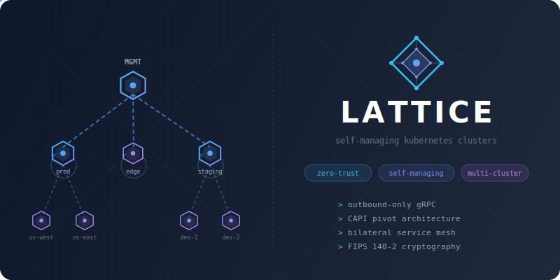

<p align="center">
  
</p>

<h3 align="center">Self-managing Kubernetes clusters with zero-trust networking</h3>

---

> **Sandbox project** — Lattice is a distributed systems sandbox for exploring self-managing Kubernetes clusters. It is not production-ready and is not offered as a product. Use it to learn, experiment, and prototype.

Lattice is a Kubernetes operator for multi-cluster lifecycle management. It provisions clusters via Cluster API, pivots them to be fully self-managing, and compiles a single **LatticeService** CRD into all the resources a service needs — with default-deny networking, Cedar policy authorization, and secret management built in.

**Key ideas:**

- **One CRD per service** — LatticeService replaces Deployment, Service, NetworkPolicy, AuthorizationPolicy, ExternalSecret, ScaledObject, PVC, Gateway, and more
- **Self-managing clusters** — every cluster owns its own CAPI resources after pivot and operates independently
- **Bilateral mesh** — traffic requires mutual consent (caller declares outbound, callee declares inbound), enforced at Cilium L4 + Istio L7
- **Cedar policies** — default-deny authorization for proxy access, secrets, and security overrides
- **Outbound-only architecture** — child clusters never accept inbound connections

Browse the [examples/](examples/) directory to get started.

---

## Quick Start

```bash
# Provision a self-managing cluster
lattice install -f examples/cluster/management-cluster.yaml

# Deploy services
kubectl apply -f examples/webapp/

# See your fleet
lattice get clusters
lattice get hierarchy
```

## Development

```bash
cargo build              # Build all crates
cargo test               # Unit tests
cargo clippy             # Lint
cargo fmt -- --check     # Format check

# E2E tests (requires Docker)
cargo test --features provider-e2e --test e2e
```

## License

See [LICENSE](LICENSE).
