# Lattice E2E Test Suite Documentation

This document provides a comprehensive explanation of the Lattice end-to-end (E2E) test suite, including detailed diagrams of test flows, architecture, and validation processes.

## Overview

The Lattice E2E test suite validates the complete lifecycle of self-managing Kubernetes clusters. It consists of **5 test modules** that verify:

- **Pivot architecture** - Clusters become fully self-managing after provisioning
- **Cluster independence** - Workload clusters operate even if parent is deleted
- **Service mesh policies** - Bilateral agreements for network traffic control
- **Storage & co-location** - Shared volumes and pod scheduling constraints
- **Multi-provider support** - Docker, AWS, OpenStack, and Proxmox

---

## Test Suite Architecture

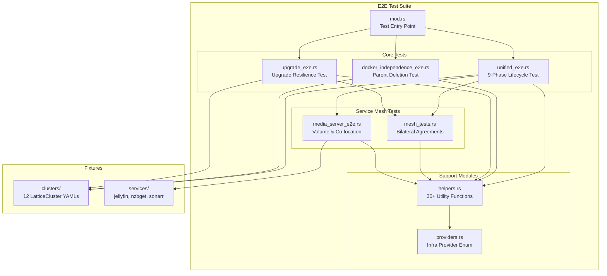
```mermaid
graph TB
    subgraph "E2E Test Suite"
        MOD[mod.rs<br/>Test Entry Point]

        subgraph "Core Tests"
            PIVOT[unified_e2e.rs<br/>9-Phase Lifecycle Test]
            INDEP[docker_independence_e2e.rs<br/>Parent Deletion Test]
            UPGRADE[upgrade_e2e.rs<br/>Upgrade Resilience Test]
        end

        subgraph "Service Mesh Tests"
            MESH[mesh_tests.rs<br/>Bilateral Agreements]
            MEDIA[media_server_e2e.rs<br/>Volume & Co-location]
        end

        subgraph "Support Modules"
            HELP[helpers.rs<br/>30+ Utility Functions]
            PROV[providers.rs<br/>Infra Provider Enum]
        end
    end

    subgraph "Fixtures"
        CLUST[clusters/<br/>12 LatticeCluster YAMLs]
        SVC[services/<br/>jellyfin, nzbget, sonarr]
    end

    MOD --> PIVOT
    MOD --> INDEP
    MOD --> UPGRADE
    PIVOT --> MESH
    PIVOT --> MEDIA
    UPGRADE --> MESH
    PIVOT --> HELP
    INDEP --> HELP
    UPGRADE --> HELP
    MESH --> HELP
    MEDIA --> HELP
    HELP --> PROV
    PIVOT --> CLUST
    INDEP --> CLUST
    UPGRADE --> CLUST
    MEDIA --> SVC
```

---

## Test 1: Main Pivot E2E Test (`unified_e2e.rs`)

The primary E2E test validates the complete Lattice lifecycle in **9 phases**. This test proves that clusters become fully self-managing and can operate independently.

### High-Level Flow

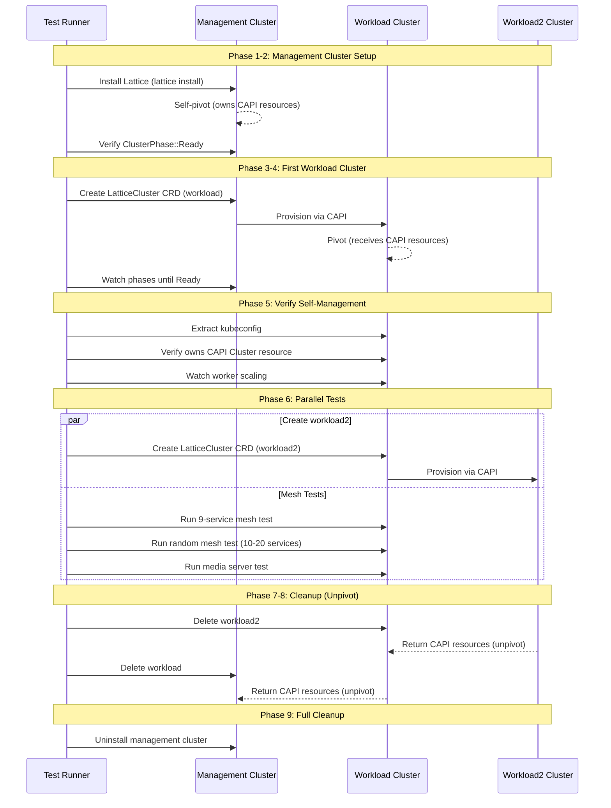
```mermaid
sequenceDiagram
    participant T as Test Runner
    participant M as Management Cluster
    participant W1 as Workload Cluster
    participant W2 as Workload2 Cluster

    Note over T,W2: Phase 1-2: Management Cluster Setup
    T->>M: Install Lattice (lattice install)
    M-->>M: Self-pivot (owns CAPI resources)
    T->>M: Verify ClusterPhase::Ready

    Note over T,W2: Phase 3-4: First Workload Cluster
    T->>M: Create LatticeCluster CRD (workload)
    M->>W1: Provision via CAPI
    W1-->>W1: Pivot (receives CAPI resources)
    T->>M: Watch phases until Ready

    Note over T,W2: Phase 5: Verify Self-Management
    T->>W1: Extract kubeconfig
    T->>W1: Verify owns CAPI Cluster resource
    T->>W1: Watch worker scaling

    Note over T,W2: Phase 6: Parallel Tests
    par Create workload2
        T->>W1: Create LatticeCluster CRD (workload2)
        W1->>W2: Provision via CAPI
    and Mesh Tests
        T->>W1: Run 9-service mesh test
        T->>W1: Run random mesh test (10-20 services)
        T->>W1: Run media server test
    end

    Note over T,W2: Phase 7-8: Cleanup (Unpivot)
    T->>W1: Delete workload2
    W2-->>W1: Return CAPI resources (unpivot)
    T->>M: Delete workload
    W1-->>M: Return CAPI resources (unpivot)

    Note over T,W2: Phase 9: Full Cleanup
    T->>M: Uninstall management cluster
```

### Phase-by-Phase Breakdown

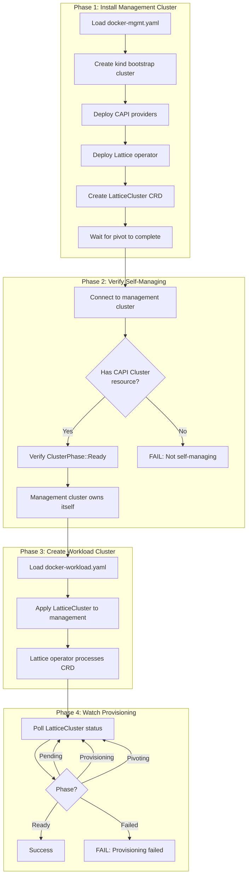
```mermaid
flowchart TD
    subgraph "Phase 1: Install Management Cluster"
        P1A[Load docker-mgmt.yaml] --> P1B[Create kind bootstrap cluster]
        P1B --> P1C[Deploy CAPI providers]
        P1C --> P1D[Deploy Lattice operator]
        P1D --> P1E[Create LatticeCluster CRD]
        P1E --> P1F[Wait for pivot to complete]
    end

    subgraph "Phase 2: Verify Self-Managing"
        P2A[Connect to management cluster] --> P2B{Has CAPI Cluster<br/>resource?}
        P2B -->|Yes| P2C[Verify ClusterPhase::Ready]
        P2B -->|No| P2D[FAIL: Not self-managing]
        P2C --> P2E[Management cluster owns itself]
    end

    subgraph "Phase 3: Create Workload Cluster"
        P3A[Load docker-workload.yaml] --> P3B[Apply LatticeCluster to management]
        P3B --> P3C[Lattice operator processes CRD]
    end

    subgraph "Phase 4: Watch Provisioning"
        P4A[Poll LatticeCluster status] --> P4B{Phase?}
        P4B -->|Pending| P4A
        P4B -->|Provisioning| P4A
        P4B -->|Pivoting| P4A
        P4B -->|Ready| P4C[Success]
        P4B -->|Failed| P4D[FAIL: Provisioning failed]
    end

    P1F --> P2A
    P2E --> P3A
    P3C --> P4A
```

### Phase 5-6: Verification & Parallel Tests

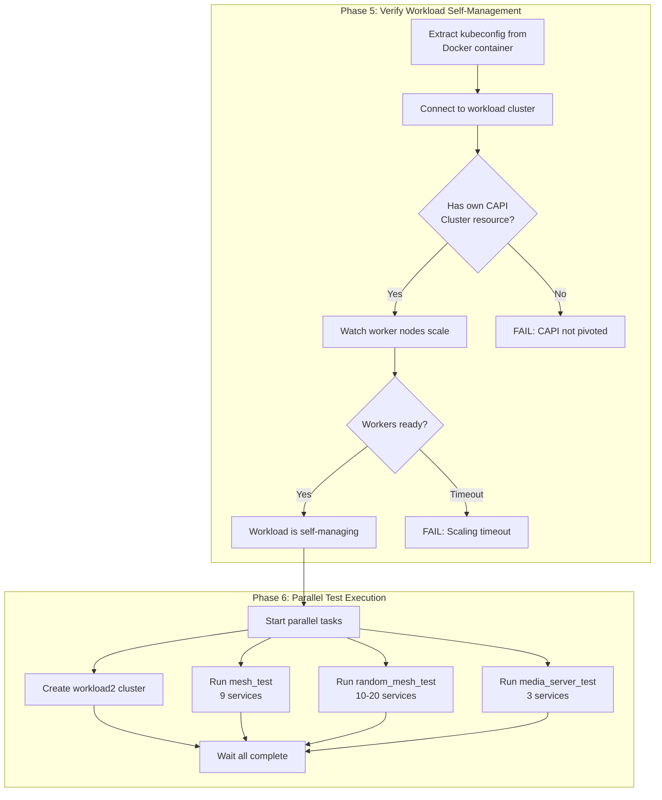
```mermaid
flowchart TD
    subgraph "Phase 5: Verify Workload Self-Management"
        P5A[Extract kubeconfig from<br/>Docker container] --> P5B[Connect to workload cluster]
        P5B --> P5C{Has own CAPI<br/>Cluster resource?}
        P5C -->|Yes| P5D[Watch worker nodes scale]
        P5C -->|No| P5E[FAIL: CAPI not pivoted]
        P5D --> P5F{Workers ready?}
        P5F -->|Yes| P5G[Workload is self-managing]
        P5F -->|Timeout| P5H[FAIL: Scaling timeout]
    end

    subgraph "Phase 6: Parallel Test Execution"
        P6A[Start parallel tasks]

        P6A --> P6B[Create workload2 cluster]
        P6A --> P6C[Run mesh_test<br/>9 services]
        P6A --> P6D[Run random_mesh_test<br/>10-20 services]
        P6A --> P6E[Run media_server_test<br/>3 services]

        P6B --> P6F[Wait all complete]
        P6C --> P6F
        P6D --> P6F
        P6E --> P6F
    end

    P5G --> P6A
```

### Phase 7-9: Cleanup & Unpivot

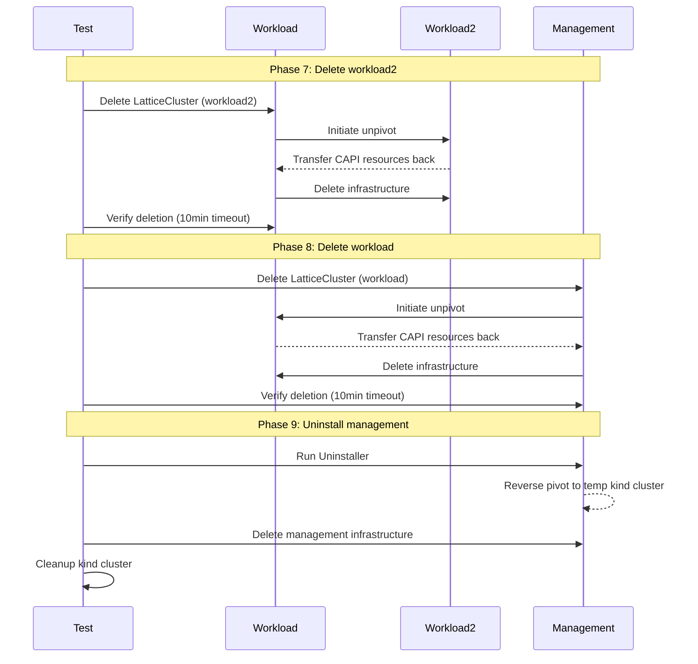
```mermaid
sequenceDiagram
    participant T as Test
    participant W1 as Workload
    participant W2 as Workload2
    participant M as Management

    Note over T,M: Phase 7: Delete workload2
    T->>W1: Delete LatticeCluster (workload2)
    W1->>W2: Initiate unpivot
    W2-->>W1: Transfer CAPI resources back
    W1->>W2: Delete infrastructure
    T->>W1: Verify deletion (10min timeout)

    Note over T,M: Phase 8: Delete workload
    T->>M: Delete LatticeCluster (workload)
    M->>W1: Initiate unpivot
    W1-->>M: Transfer CAPI resources back
    M->>W1: Delete infrastructure
    T->>M: Verify deletion (10min timeout)

    Note over T,M: Phase 9: Uninstall management
    T->>M: Run Uninstaller
    M-->>M: Reverse pivot to temp kind cluster
    T->>M: Delete management infrastructure
    T->>T: Cleanup kind cluster
```

---

## Test 2: Cluster Independence Test (`docker_independence_e2e.rs`)

This test validates that workload clusters are **truly independent** and continue operating even after the parent cluster is forcefully deleted.

### Test Flow

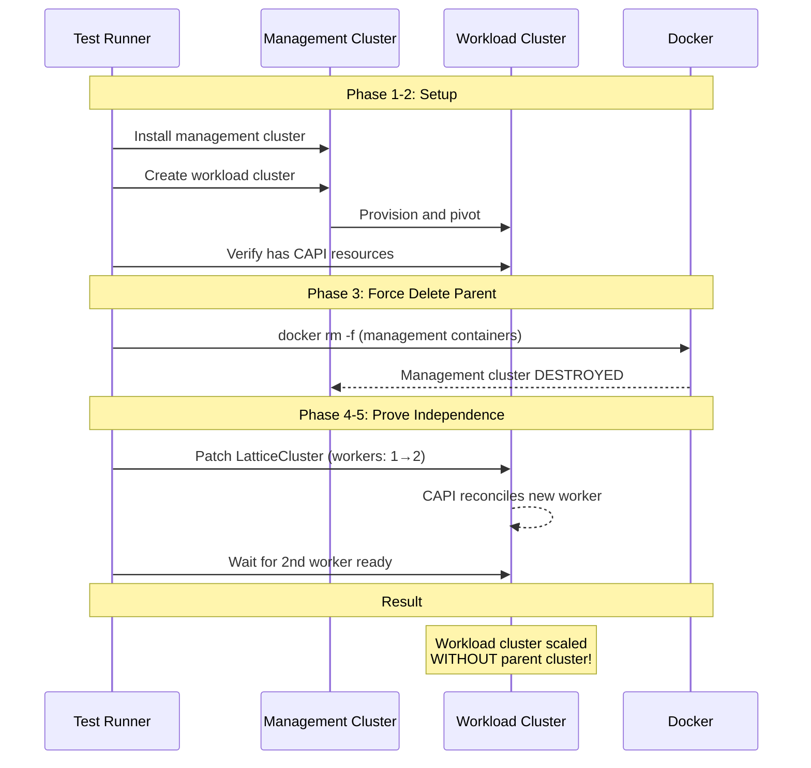
```mermaid
sequenceDiagram
    participant T as Test Runner
    participant M as Management Cluster
    participant W as Workload Cluster
    participant D as Docker

    Note over T,D: Phase 1-2: Setup
    T->>M: Install management cluster
    T->>M: Create workload cluster
    M->>W: Provision and pivot
    T->>W: Verify has CAPI resources

    Note over T,D: Phase 3: Force Delete Parent
    T->>D: docker rm -f (management containers)
    D-->>M: Management cluster DESTROYED

    Note over T,D: Phase 4-5: Prove Independence
    T->>W: Patch LatticeCluster (workers: 1→2)
    W-->>W: CAPI reconciles new worker
    T->>W: Wait for 2nd worker ready

    Note over T,D: Result
    Note over W: Workload cluster scaled<br/>WITHOUT parent cluster!
```

### State Transitions

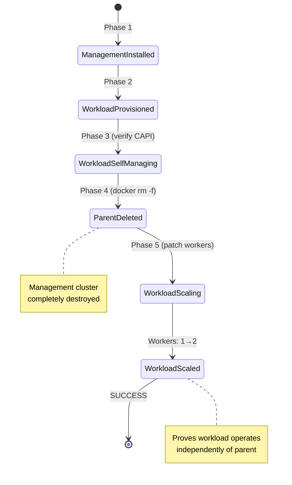
```mermaid
stateDiagram-v2
    [*] --> ManagementInstalled: Phase 1
    ManagementInstalled --> WorkloadProvisioned: Phase 2
    WorkloadProvisioned --> WorkloadSelfManaging: Phase 3 (verify CAPI)
    WorkloadSelfManaging --> ParentDeleted: Phase 4 (docker rm -f)
    ParentDeleted --> WorkloadScaling: Phase 5 (patch workers)
    WorkloadScaling --> WorkloadScaled: Workers: 1→2
    WorkloadScaled --> [*]: SUCCESS

    note right of ParentDeleted
        Management cluster
        completely destroyed
    end note

    note right of WorkloadScaled
        Proves workload operates
        independently of parent
    end note
```

---

## Test 3: Service Mesh Tests (`mesh_tests.rs`)

The mesh tests validate **bilateral agreements** - a security model where traffic is only allowed when BOTH the caller and callee explicitly agree.

### Bilateral Agreement Concept

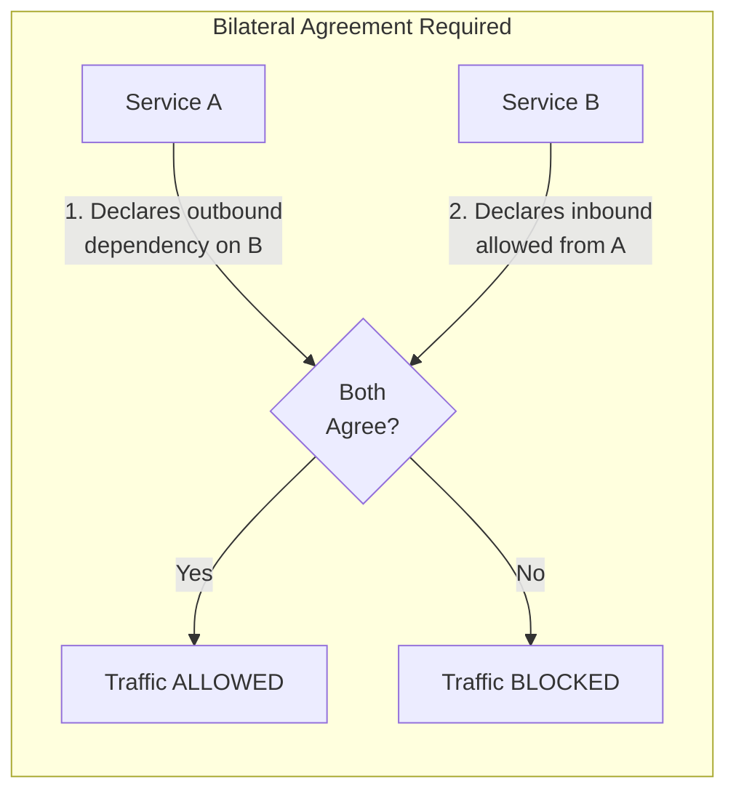
```mermaid
flowchart LR
    subgraph "Bilateral Agreement Required"
        A[Service A] -->|"1. Declares outbound<br/>dependency on B"| AGREE{Both<br/>Agree?}
        B[Service B] -->|"2. Declares inbound<br/>allowed from A"| AGREE
        AGREE -->|Yes| ALLOW[Traffic ALLOWED]
        AGREE -->|No| BLOCK[Traffic BLOCKED]
    end
```

### Policy Generation Flow

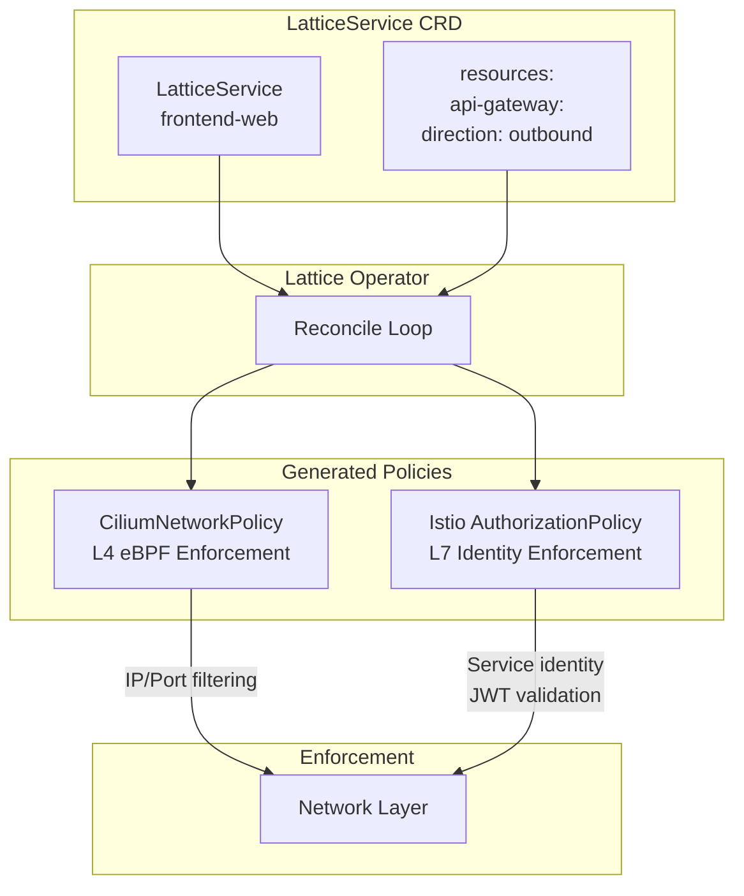
```mermaid
flowchart TD
    subgraph "LatticeService CRD"
        LS[LatticeService<br/>frontend-web]
        RES[resources:<br/>  api-gateway:<br/>    direction: outbound]
    end

    subgraph "Lattice Operator"
        OP[Reconcile Loop]
    end

    subgraph "Generated Policies"
        CNP[CiliumNetworkPolicy<br/>L4 eBPF Enforcement]
        IAP[Istio AuthorizationPolicy<br/>L7 Identity Enforcement]
    end

    LS --> OP
    RES --> OP
    OP --> CNP
    OP --> IAP

    subgraph "Enforcement"
        CNP --> |"IP/Port filtering"| ENF[Network Layer]
        IAP --> |"Service identity<br/>JWT validation"| ENF
    end
```

### 9-Service Fixed Mesh Test

This test deploys a **3-layer microservice architecture** with specific bilateral agreements.

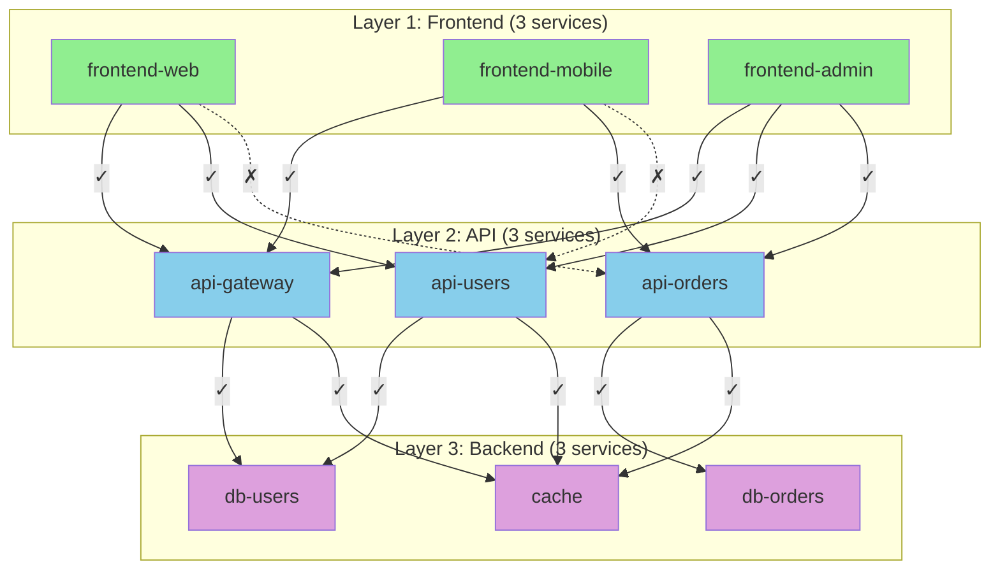
```mermaid
graph TB
    subgraph "Layer 1: Frontend (3 services)"
        FW[frontend-web]
        FM[frontend-mobile]
        FA[frontend-admin]
    end

    subgraph "Layer 2: API (3 services)"
        AG[api-gateway]
        AU[api-users]
        AO[api-orders]
    end

    subgraph "Layer 3: Backend (3 services)"
        DU[db-users]
        DO[db-orders]
        CA[cache]
    end

    %% Allowed connections (bilateral agreements exist)
    FW -->|"✓"| AG
    FW -->|"✓"| AU
    FM -->|"✓"| AG
    FM -->|"✓"| AO
    FA -->|"✓"| AG
    FA -->|"✓"| AU
    FA -->|"✓"| AO

    AG -->|"✓"| DU
    AG -->|"✓"| CA
    AU -->|"✓"| DU
    AU -->|"✓"| CA
    AO -->|"✓"| DO
    AO -->|"✓"| CA

    %% Blocked connections (no bilateral agreement)
    FW -.->|"✗"| AO
    FM -.->|"✗"| AU

    style FW fill:#90EE90
    style FM fill:#90EE90
    style FA fill:#90EE90
    style AG fill:#87CEEB
    style AU fill:#87CEEB
    style AO fill:#87CEEB
    style DU fill:#DDA0DD
    style DO fill:#DDA0DD
    style CA fill:#DDA0DD
```

### Test Execution Flow

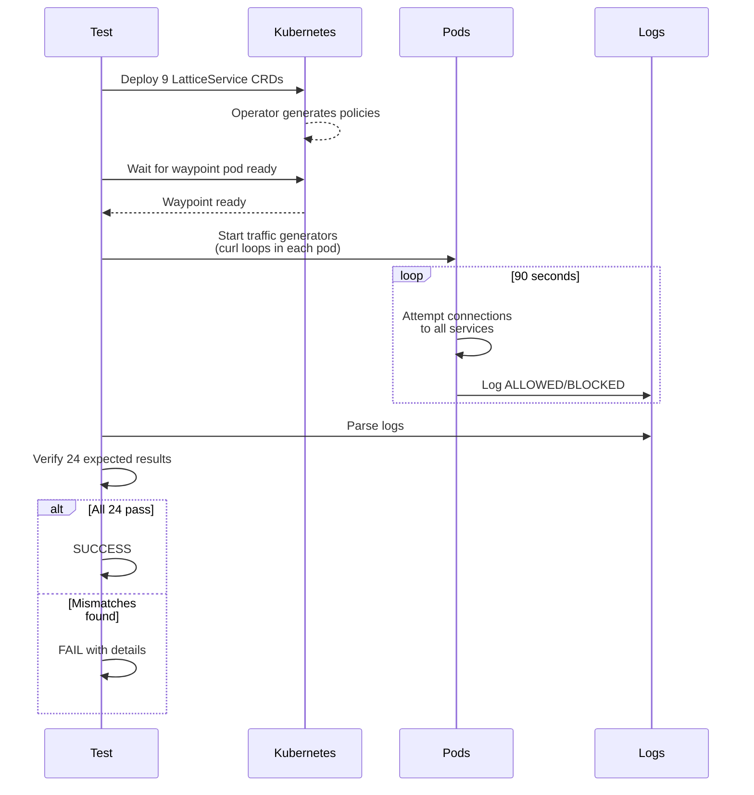
```mermaid
sequenceDiagram
    participant T as Test
    participant K as Kubernetes
    participant P as Pods
    participant L as Logs

    T->>K: Deploy 9 LatticeService CRDs
    K-->>K: Operator generates policies

    T->>K: Wait for waypoint pod ready
    K-->>T: Waypoint ready

    T->>P: Start traffic generators<br/>(curl loops in each pod)

    loop 90 seconds
        P->>P: Attempt connections<br/>to all services
        P->>L: Log ALLOWED/BLOCKED
    end

    T->>L: Parse logs
    T->>T: Verify 24 expected results

    alt All 24 pass
        T->>T: SUCCESS
    else Mismatches found
        T->>T: FAIL with details
    end
```

### Randomized Large-Scale Mesh Test

Tests **10-20 services** across 5 layers with randomized connections.

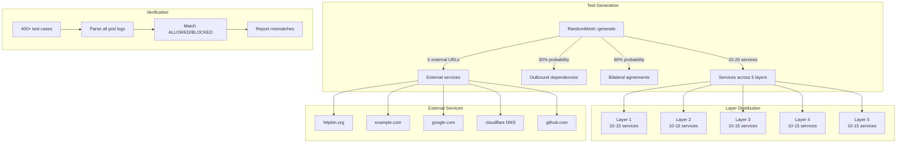
```mermaid
flowchart TD
    subgraph "Test Generation"
        GEN[RandomMesh::generate]
        GEN --> |"10-20 services"| SVC[Services across 5 layers]
        GEN --> |"30% probability"| OUT[Outbound dependencies]
        GEN --> |"60% probability"| BI[Bilateral agreements]
        GEN --> |"5 external URLs"| EXT[External services]
    end

    subgraph "Layer Distribution"
        L1[Layer 1<br/>10-15 services]
        L2[Layer 2<br/>10-15 services]
        L3[Layer 3<br/>10-15 services]
        L4[Layer 4<br/>10-15 services]
        L5[Layer 5<br/>10-15 services]
    end

    SVC --> L1
    SVC --> L2
    SVC --> L3
    SVC --> L4
    SVC --> L5

    subgraph "External Services"
        E1[httpbin.org]
        E2[example.com]
        E3[google.com]
        E4[cloudflare DNS]
        E5[github.com]
    end

    EXT --> E1
    EXT --> E2
    EXT --> E3
    EXT --> E4
    EXT --> E5

    subgraph "Verification"
        VER[400+ test cases]
        VER --> PARSE[Parse all pod logs]
        PARSE --> MATCH[Match ALLOWED/BLOCKED]
        MATCH --> REPORT[Report mismatches]
    end
```

---

## Test 4: Media Server Test (`media_server_e2e.rs`)

This test validates **shared volumes** and **pod co-location** using a real-world media server stack.

### Service Architecture

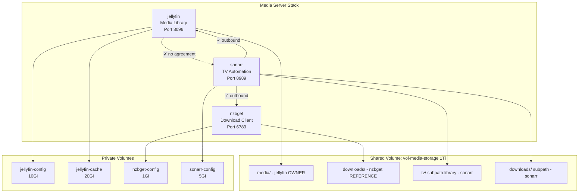
```mermaid
graph TB
    subgraph "Media Server Stack"
        J[jellyfin<br/>Media Library<br/>Port 8096]
        N[nzbget<br/>Download Client<br/>Port 6789]
        S[sonarr<br/>TV Automation<br/>Port 8989]
    end

    subgraph "Shared Volume: vol-media-storage 1Ti"
        M1["media/ - jellyfin OWNER"]
        M2["downloads/ - nzbget REFERENCE"]
        M3["tv/ subpath:library - sonarr"]
        M4["downloads/ subpath - sonarr"]
    end

    subgraph "Private Volumes"
        JC[jellyfin-config<br/>10Gi]
        JCA[jellyfin-cache<br/>20Gi]
        NC[nzbget-config<br/>1Gi]
        SC[sonarr-config<br/>5Gi]
    end

    J --> M1
    J --> JC
    J --> JCA
    N --> M2
    N --> NC
    S --> M3
    S --> M4
    S --> SC

    %% Bilateral agreements
    S -->|"✓ outbound"| J
    S -->|"✓ outbound"| N
    J -.->|"✗ no agreement"| S
```

### Test Validation Flow

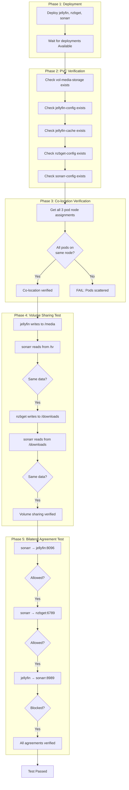
```mermaid
flowchart TD
    subgraph "Phase 1: Deployment"
        D1[Deploy jellyfin, nzbget, sonarr]
        D1 --> D2[Wait for deployments Available]
    end

    subgraph "Phase 2: PVC Verification"
        D2 --> P1[Check vol-media-storage exists]
        P1 --> P2[Check jellyfin-config exists]
        P2 --> P3[Check jellyfin-cache exists]
        P3 --> P4[Check nzbget-config exists]
        P4 --> P5[Check sonarr-config exists]
    end

    subgraph "Phase 3: Co-location Verification"
        P5 --> C1[Get all 3 pod node assignments]
        C1 --> C2{All pods on<br/>same node?}
        C2 -->|Yes| C3[Co-location verified]
        C2 -->|No| C4[FAIL: Pods scattered]
    end

    subgraph "Phase 4: Volume Sharing Test"
        C3 --> V1[jellyfin writes to /media]
        V1 --> V2[sonarr reads from /tv]
        V2 --> V3{Same data?}
        V3 -->|Yes| V4[nzbget writes to /downloads]
        V4 --> V5[sonarr reads from /downloads]
        V5 --> V6{Same data?}
        V6 -->|Yes| V7[Volume sharing verified]
    end

    subgraph "Phase 5: Bilateral Agreement Test"
        V7 --> B1[sonarr → jellyfin:8096]
        B1 --> B2{Allowed?}
        B2 -->|Yes| B3[sonarr → nzbget:6789]
        B3 --> B4{Allowed?}
        B4 -->|Yes| B5[jellyfin → sonarr:8989]
        B5 --> B6{Blocked?}
        B6 -->|Yes| B7[All agreements verified]
    end

    B7 --> SUCCESS[Test Passed]
```

### Volume Ownership Model

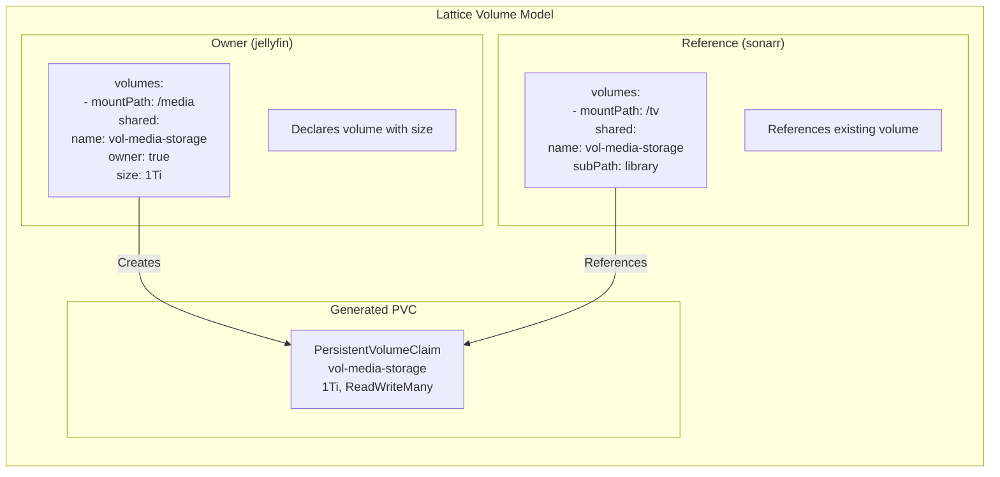
```mermaid
flowchart LR
    subgraph "Lattice Volume Model"
        subgraph "Owner (jellyfin)"
            O1[Declares volume with size]
            O2["volumes:<br/>  - mountPath: /media<br/>    shared:<br/>      name: vol-media-storage<br/>      owner: true<br/>      size: 1Ti"]
        end

        subgraph "Reference (sonarr)"
            R1[References existing volume]
            R2["volumes:<br/>  - mountPath: /tv<br/>    shared:<br/>      name: vol-media-storage<br/>      subPath: library"]
        end

        subgraph "Generated PVC"
            PVC[PersistentVolumeClaim<br/>vol-media-storage<br/>1Ti, ReadWriteMany]
        end
    end

    O2 --> |"Creates"| PVC
    R2 --> |"References"| PVC
```

---

## Test Helper Functions

The test suite uses extensive helper functions defined in `helpers.rs`.

### Kubeconfig Extraction Flow (Docker)

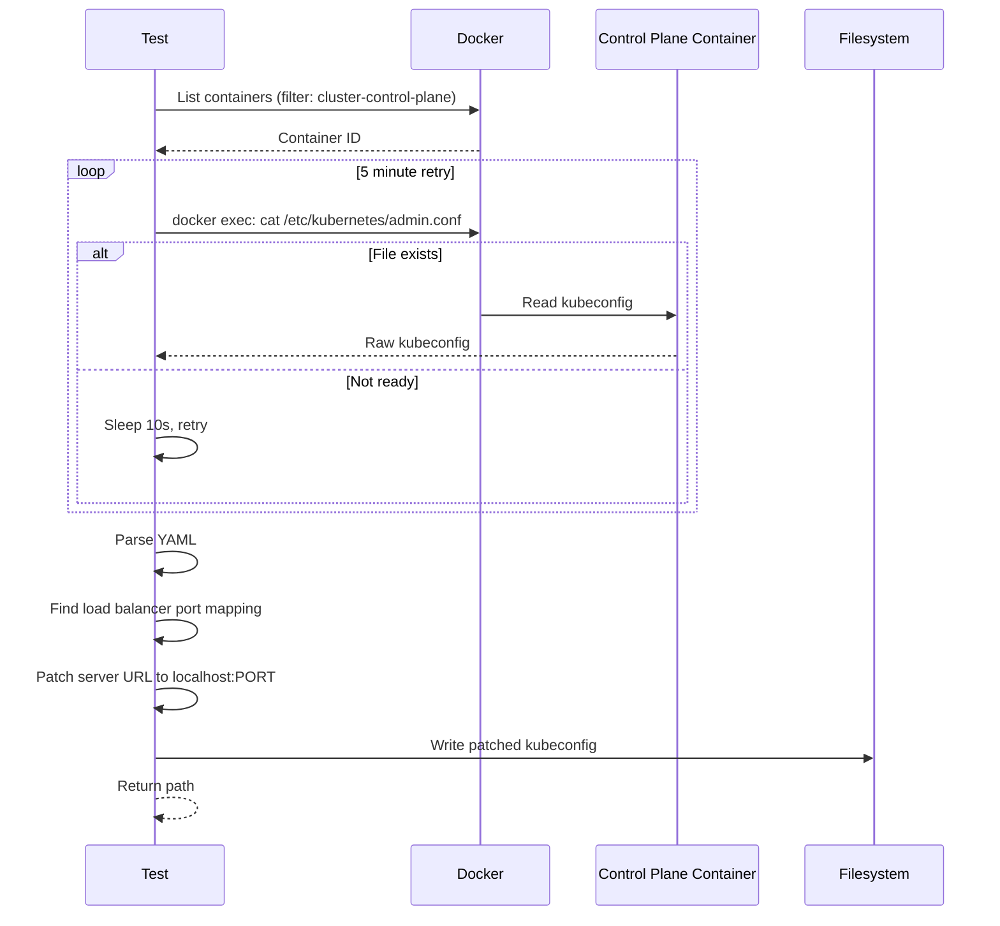
```mermaid
sequenceDiagram
    participant T as Test
    participant D as Docker
    participant CP as Control Plane Container
    participant FS as Filesystem

    T->>D: List containers (filter: cluster-control-plane)
    D-->>T: Container ID

    loop 5 minute retry
        T->>D: docker exec: cat /etc/kubernetes/admin.conf
        alt File exists
            D->>CP: Read kubeconfig
            CP-->>T: Raw kubeconfig
        else Not ready
            T->>T: Sleep 10s, retry
        end
    end

    T->>T: Parse YAML
    T->>T: Find load balancer port mapping
    T->>T: Patch server URL to localhost:PORT
    T->>FS: Write patched kubeconfig
    T-->>T: Return path
```

### Cluster Phase Watching

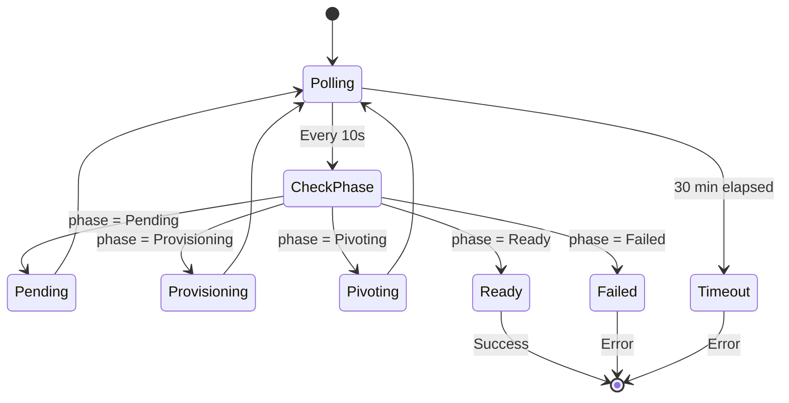
```mermaid
stateDiagram-v2
    [*] --> Polling

    Polling --> CheckPhase: Every 10s

    CheckPhase --> Pending: phase = Pending
    CheckPhase --> Provisioning: phase = Provisioning
    CheckPhase --> Pivoting: phase = Pivoting
    CheckPhase --> Ready: phase = Ready
    CheckPhase --> Failed: phase = Failed

    Pending --> Polling
    Provisioning --> Polling
    Pivoting --> Polling

    Ready --> [*]: Success
    Failed --> [*]: Error

    Polling --> Timeout: 30 min elapsed
    Timeout --> [*]: Error
```

---

## Test Configuration

### Environment Variables

| Variable | Default | Purpose |
|----------|---------|---------|
| `LATTICE_MGMT_CLUSTER_CONFIG` | `docker-mgmt.yaml` | Management cluster config |
| `LATTICE_WORKLOAD_CLUSTER_CONFIG` | `docker-workload.yaml` | First workload cluster config |
| `LATTICE_WORKLOAD2_CLUSTER_CONFIG` | `docker-workload2.yaml` | Second workload cluster config |
| `LATTICE_ENABLE_MESH_TEST` | `true` | Enable/disable mesh tests |
| `LATTICE_INDEP_MGMT_CONFIG` | - | Independence test mgmt config |
| `LATTICE_INDEP_WORKLOAD_CONFIG` | - | Independence test workload config |

### Running Tests

```bash
# Full pivot test with Docker
cargo test --features provider-e2e --test e2e unified_e2e -- --nocapture

# Independence test
cargo test --features provider-e2e --test e2e docker_independence -- --nocapture

# Skip mesh tests (faster)
LATTICE_ENABLE_MESH_TEST=false cargo test --features provider-e2e --test e2e unified_e2e

# Use cloud provider configs
LATTICE_MGMT_CLUSTER_CONFIG=fixtures/clusters/aws-mgmt.yaml \
LATTICE_WORKLOAD_CLUSTER_CONFIG=fixtures/clusters/aws-workload.yaml \
cargo test --features provider-e2e --test e2e unified_e2e -- --nocapture
```

---

## Cluster Hierarchy Visualization

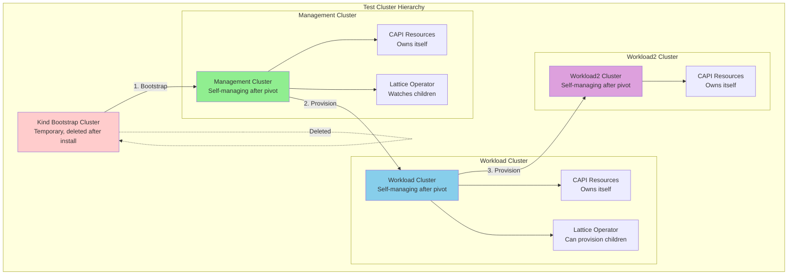
```mermaid
graph TB
    subgraph "Test Cluster Hierarchy"
        KIND[Kind Bootstrap Cluster<br/>Temporary, deleted after install]

        subgraph "Management Cluster"
            MC[Management Cluster<br/>Self-managing after pivot]
            MC_CAPI[CAPI Resources<br/>Owns itself]
            MC_OP[Lattice Operator<br/>Watches children]
        end

        subgraph "Workload Cluster"
            WC[Workload Cluster<br/>Self-managing after pivot]
            WC_CAPI[CAPI Resources<br/>Owns itself]
            WC_OP[Lattice Operator<br/>Can provision children]
        end

        subgraph "Workload2 Cluster"
            W2C[Workload2 Cluster<br/>Self-managing after pivot]
            W2_CAPI[CAPI Resources<br/>Owns itself]
        end
    end

    KIND -->|"1. Bootstrap"| MC
    KIND -.->|"Deleted"| KIND
    MC -->|"2. Provision"| WC
    WC -->|"3. Provision"| W2C

    MC --> MC_CAPI
    MC --> MC_OP
    WC --> WC_CAPI
    WC --> WC_OP
    W2C --> W2_CAPI

    style KIND fill:#ffcccc
    style MC fill:#90EE90
    style WC fill:#87CEEB
    style W2C fill:#DDA0DD
```

---

## Test 5: Upgrade Resilience Test (`upgrade_e2e.rs`)

This test validates that service mesh policies remain enforced during a full Kubernetes cluster upgrade.

### Security Invariant

```
During upgrade chaos (nodes draining, pods rescheduling, waypoints restarting):
- Dropped/failed traffic: ACCEPTABLE
- Incorrectly allowed traffic: NEVER ACCEPTABLE (security violation)
```

The mesh must **fail closed** - never degrade to "allow all" even under disruption.

### Test Flow

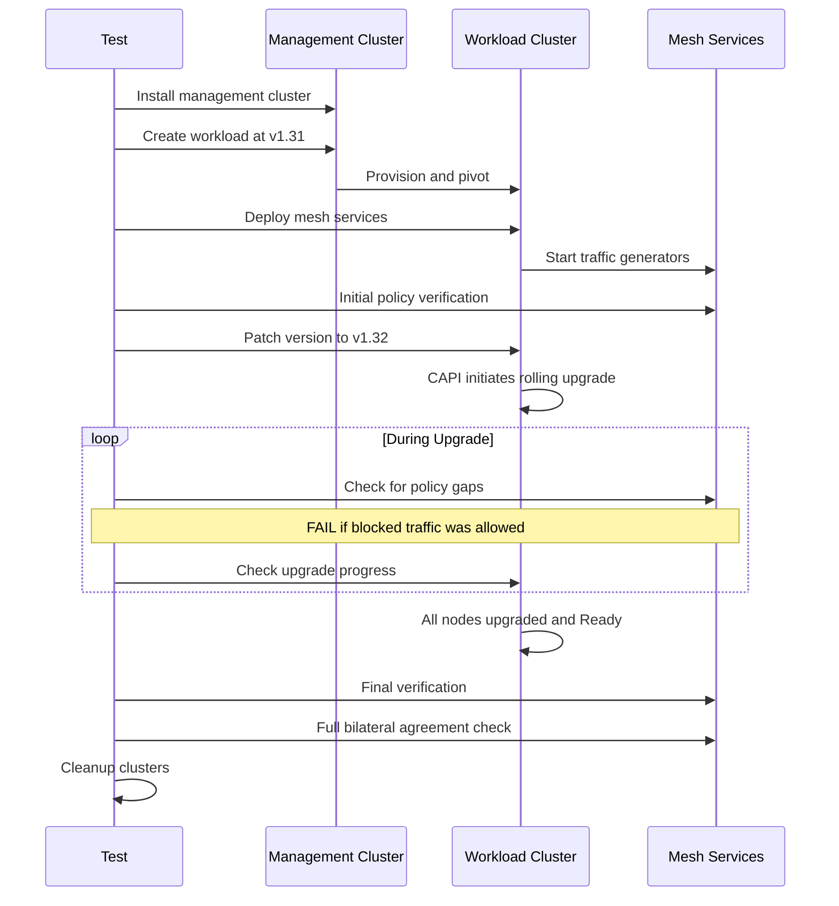
```mermaid
sequenceDiagram
    participant T as Test
    participant M as Management Cluster
    participant W as Workload Cluster
    participant Mesh as Mesh Services

    T->>M: Install management cluster
    T->>M: Create workload at v1.31
    M->>W: Provision and pivot

    T->>W: Deploy mesh services
    W->>Mesh: Start traffic generators
    T->>Mesh: Initial policy verification

    T->>W: Patch version to v1.32
    W->>W: CAPI initiates rolling upgrade

    loop During Upgrade
        T->>Mesh: Check for policy gaps
        Note over T,Mesh: FAIL if blocked traffic was allowed
        T->>W: Check upgrade progress
    end

    W->>W: All nodes upgraded and Ready
    T->>Mesh: Final verification
    T->>Mesh: Full bilateral agreement check

    T->>T: Cleanup clusters
```

### Environment Variables

| Variable | Default | Purpose |
|----------|---------|---------|
| `LATTICE_UPGRADE_FROM_VERSION` | `1.31.0` | Starting K8s version |
| `LATTICE_UPGRADE_TO_VERSION` | `1.32.0` | Target K8s version |
| `LATTICE_UPGRADE_MGMT_CONFIG` | `docker-mgmt.yaml` | Management cluster config |
| `LATTICE_UPGRADE_WORKLOAD_CONFIG` | `docker-workload.yaml` | Workload cluster config |

### Running

```bash
cargo test --features provider-e2e --test e2e upgrade_e2e -- --nocapture

# Custom versions
LATTICE_UPGRADE_FROM_VERSION=1.30.0 LATTICE_UPGRADE_TO_VERSION=1.31.0 \
  cargo test --features provider-e2e --test e2e upgrade_e2e -- --nocapture
```

---

## Test File Summary

| File | Lines | Tests | Purpose |
|------|-------|-------|---------|
| `unified_e2e.rs` | 606 | 1 | 9-phase full lifecycle validation |
| `docker_independence_e2e.rs` | 239 | 1 | Parent deletion resilience |
| `upgrade_e2e.rs` | 300 | 1 | Upgrade resilience with mesh traffic |
| `mesh_tests.rs` | 1,550 | 2 | Fixed 9-service + random 10-20 service mesh |
| `media_server_e2e.rs` | 397 | 1 | Volume sharing + co-location |
| `helpers.rs` | 813 | - | 30+ utility functions |
| `providers.rs` | 44 | - | Infrastructure provider enum |
| **Total** | **~3,950** | **6** | Complete Lattice validation |

---

## What Success Looks Like

A successful E2E test run validates:

1. **Self-Management** - Every cluster owns its CAPI resources after pivot
2. **Independence** - Workload clusters operate without parent
3. **Security** - Bilateral agreements enforce traffic policies correctly
4. **Upgrade Resilience** - Policies remain enforced during K8s upgrades
5. **Storage** - Shared volumes work across pods with correct isolation
6. **Co-location** - Pods requiring shared storage run on same node
7. **Lifecycle** - Install, provision, scale, delete, and uninstall all work
8. **Multi-level Hierarchy** - management → workload → workload2 chain functions

The test proves that Lattice delivers on its core promise: **fully self-managing Kubernetes clusters that operate independently once provisioned**.
