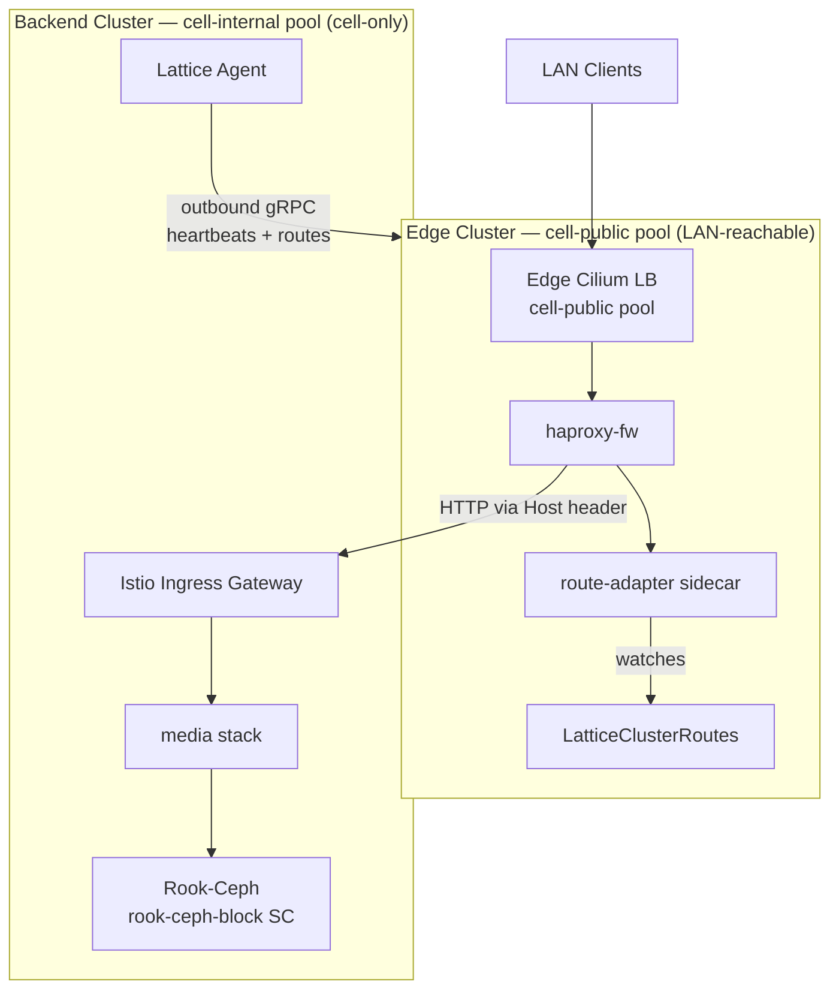

# Homelab: Edge HAProxy DMZ + Media Stack

Two-cluster Basis setup. The edge cluster runs HAProxy as a DMZ/firewall on
the LAN-reachable `cell-public` pool. The backend cluster runs the media
stack (jellyfin, sonarr, nzbget + VPN) on the internal-only `cell-internal`
pool, with Rook-Ceph providing durable block storage for media.

Routes are discovered automatically via heartbeats — no manual IP management.

See [lattice-homelab](https://github.com/evan-hines-js/lattice-homelab) for a
live implementation of this setup.

## Architecture



| Pool | Reachable from | What lives there |
|------|----------------|------------------|
| `cell-public` | LAN | edge apiserver VIP, edge Cilium LB block (haproxy-fw front IP) |
| `cell-internal` | within the cell only | backend apiserver VIP, backend Istio Gateway LB IPs |

The basis controller's network config defines these pools. The cell-internal
pool is reachable from the edge cluster (east-west) but not advertised to LAN,
so backend services are only accessible through HAProxy.

## How it works

- Backend services set `advertise: { allowedServices: ["*"] }` on ingress routes
- Route reconciler discovers these + resolves Gateway LB IPs (cell-internal)
- Agent reads LatticeClusterRoutes CRD and heartbeats routes to the edge
- Edge merges child routes into per-child LatticeClusterRoutes CRDs
- Istio multi-cluster: the operator wires remote secrets + Service stubs so
  istiod discovers backend services natively
- HAProxy north-south: route-adapter sidecar watches the CRD, renders
  `haproxy.cfg`, and routes by Host header to backend Gateway LB IPs
- Persistent volumes on backend land on `rook-ceph-block`, replicated across
  the three workers (failureDomain=host, replication=3)

## Prerequisites

- A Basis controller reachable on the LAN with at least two IP pools defined:
  `cell-public` (LAN-routed) and `cell-internal` (cell-only)
- Lattice operator installed on a bootstrap cluster (or use the edge cluster
  itself to bootstrap)
- `kubectl` and `docker` CLI tools
- A cert-manager `ClusterIssuer` named `homelab-selfsigned` on the backend
  cluster (or change the issuer name in the media YAMLs)

## Step 1: Set Basis credentials

`lattice install` seeds Basis credentials into the bootstrap cluster from
these env vars (and the installed edge cluster pivots them along with the
`InfraProvider` / `ImageProvider` defined in `edge-cluster.yaml`):

```bash
export BASIS_CONTROLLER_URL=https://your-basis:7443
export BASIS_CLIENT_CERT="$(cat client.crt)"
export BASIS_CLIENT_KEY="$(cat client.key)"
export BASIS_CA_CERT="$(cat ca.crt)"
```

Then update `serverUrl` in `edge-cluster.yaml` to point at your Basis
controller.

## Step 2: Build and push the route-adapter image

```bash
cd route-adapter
docker build -t ghcr.io/evan-hines-js/lattice-route-adapter:latest .
docker push ghcr.io/evan-hines-js/lattice-route-adapter:latest
cd ..
```

## Step 3: Install the edge cluster

The edge is the root of the hierarchy, so it can't be `kubectl apply`-ed —
there's no parent yet. `lattice install` spins up a temporary kind bootstrap
cluster, provisions the edge from `edge-cluster.yaml`, pivots CAPI onto it,
and tears the bootstrap down:

```bash
lattice install -f edge-cluster.yaml
```

The bundle includes the `LatticeCluster`, the basis `InfraProvider`, and the
default `ImageProvider` — the installer applies all three. When it returns,
`~/.lattice/kubeconfig.root` points at the edge cluster's apiserver and
`~/.lattice/kubeconfig.proxy` points at the Cedar-authorized proxy.

## Step 4: Deploy HAProxy on the edge

```bash
kubectl apply -f edge/namespace.yaml
kubectl apply -f edge/haproxy-fw.yaml
kubectl wait --for=condition=Ready latticeservice/haproxy-fw -n edge --timeout=5m
```

## Step 5: Create the backend cluster

The edge cluster provisions the backend on `cell-internal`. Because the
backend's spec sets `storage: true`, the operator also creates a
`RookInstall` sized for the worker pool (3 workers → mon.count=3,
replication=3, host failure domain) as part of bootstrap — no manual
`kubectl apply` needed.

```bash
kubectl apply -f backend-cluster.yaml
kubectl wait --for=condition=Ready latticecluster/backend --timeout=30m
```

## Step 6: Get the backend kubeconfig and verify storage

```bash
# Extract from the proxy (recommended — preserves Cedar authorization)
BACKEND_KC=$(lattice kubeconfig backend)
# Or extract directly from the secret
BACKEND_KC=/tmp/backend-kubeconfig
kubectl get secret backend-kubeconfig -o jsonpath='{.data.value}' | base64 -d > $BACKEND_KC

# Wait for Rook to reach HEALTH_OK (mons forming quorum + OSDs LUKS-format
# their disks; usually under 10 minutes on real hardware).
kubectl --kubeconfig=$BACKEND_KC wait --for=jsonpath='{.status.phase}'=Ready \
  rookinstall/default --timeout=20m

# `rook-ceph-block` should be the only default StorageClass — the
# RookInstall controller demotes the bootstrap-installed `standard`.
kubectl --kubeconfig=$BACKEND_KC get sc
# rook-ceph-block (default)   rook-ceph.rbd.csi.ceph.com   ...
# standard                    rancher.io/local-path        ...
```

## Step 7: Deploy the media stack on the backend

```bash
kubectl --kubeconfig=$BACKEND_KC apply -f backend/media/namespace.yaml
kubectl --kubeconfig=$BACKEND_KC apply -f backend/media/
```

The volume resources in `backend/media/` don't pin a `storageClassName`, so
they bind against the cluster default — `rook-ceph-block` — and survive node
failures.

## Step 8: Publish DNS records to Pi-hole

`edge/dns-provider.yaml` defines a `DNSProvider` for your Pi-hole. The
operator brings up an `external-dns` Deployment that watches the
haproxy-fw HTTPRoute and PUTs one A record per hostname to Pi-hole's
customdns API — no manual `/etc/hosts` edits.

Edit `pihole.url`, `resolver`, and the password in
`edge/dns-provider.yaml` to match your Pi-hole, then apply:

```bash
kubectl apply -f edge/dns-provider.yaml
kubectl wait --for=jsonpath='{.status.phase}'=Ready \
  dnsprovider/pihole-home -n lattice-system --timeout=2m
```

Verify the records landed:

```bash
curl -s "http://<pihole-ip>/admin/api.php?customdns&action=get&auth=<password>"
# [["jellyfin.home.arpa","<edge-lb-ip>"],
#  ["sonarr.home.arpa","<edge-lb-ip>"],
#  ["nzbget.home.arpa","<edge-lb-ip>"]]
```

## Step 9: Verify

```bash
# Routes propagated from backend to edge
kubectl get latticeclusterroutes

# All services Ready on backend
kubectl --kubeconfig=$BACKEND_KC get latticeservices -A

# Ceph healthy
kubectl --kubeconfig=$BACKEND_KC -n rook-ceph get cephcluster

# Access UIs
curl http://jellyfin.home.arpa
curl http://sonarr.home.arpa
```

## Customization

- **VPN egress**: Edit the wireguard sidecar config in `backend/media/nzbget.yaml`
  with your WireGuard credentials
- **Storage sizes**: Adjust `size` in volume resources; OSD disks are sized via
  `dataDiskGibs` on the backend worker pool
- **VM sizing**: Edit `instanceType` in cluster YAMLs
- **Restrict access**: Change `allowedServices: ["*"]` to specific callers like
  `["edge/haproxy-fw"]`
- **Smaller backend**: Drop to 2 workers if disk is scarce — the operator
  auto-tunes `RookInstall` to mon=1, replication=2, host failure domain.
  At 1 worker it falls back to osd failure domain with stacked mons (dev
  only; node failure loses all replicas)
