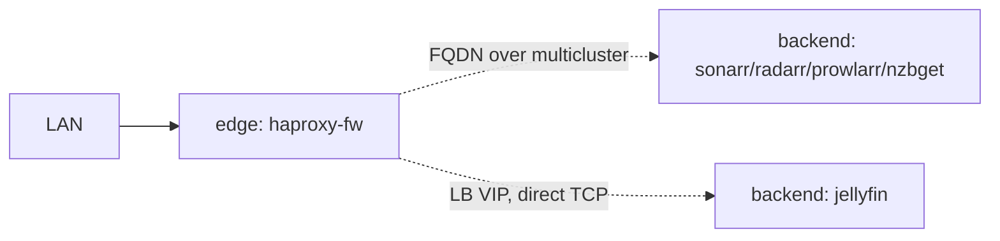

# Homelab: Edge HAProxy DMZ + Media Stack

Two-cluster Basis setup. The **edge** cluster runs HAProxy as the DMZ on a
LAN-reachable Cilium pool. The **backend** cluster runs the media stack
(jellyfin + sonarr/radarr/prowlarr/nzbget) on an internal-only Cilium pool,
with Rook-Ceph providing block storage.



| Service | Exposure | Path from haproxy |
|---|---|---|
| sonarr / radarr / prowlarr / nzbget | mesh-internal (`advertise: ["*"]`, no ingress) | FQDN over Istio multicluster |
| jellyfin | `serviceType: LoadBalancer` (no Gateway envoy in path) | direct TCP to LB VIP via Cilium BGP |
| haproxy-fw | Gateway API ingress on the LAN side | (entry point) |

Hostnames live exclusively on `haproxy-fw.spec.ingress` — backend services
have no public DNS, no L7 gateway, no externally-routable VIP. The route-
adapter sidecar reads haproxy-fw's own ingress and looks up backends in
`LatticeClusterRoutes` by service name (first label of the hostname).

`jellyfin` uses LB-direct because Istio 1.29.2/1.30.0-beta.0 ambient wedges
on its seek-driven Range-request churn — see `istio-hbone-wedge-repro` for
the minimal reproducer.

## Prerequisites

- Basis controller reachable on the LAN with `cell-public` (LAN-routed) and
  `cell-internal` (cell-only) IP pools defined.
- `kubectl`, `docker`, and the `lattice` CLI installed.
- Pi-hole reachable for DNS (or replace `edge/dns-provider.yaml` with your
  preferred provider).
- A cert-manager `ClusterIssuer` named `homelab-selfsigned` if you re-add
  TLS to haproxy-fw's ingress.

## 1. Install the edge cluster

```bash
export BASIS_CONTROLLER_URL=https://your-basis:7443
export BASIS_CLIENT_CERT="$(cat client.crt)"
export BASIS_CLIENT_KEY="$(cat client.key)"
export BASIS_CA_CERT="$(cat ca.crt)"

cd route-adapter && ./build.sh && cd ..   # build + push the haproxy sidecar image
lattice install -f edge-cluster.yaml      # provisions edge, pivots, points kubeconfig at edge
```

## 2. Deploy haproxy-fw + DNS provider on the edge

```bash
kubectl apply -f edge/namespace.yaml
kubectl apply -f edge/dns-provider.yaml      # external-dns → Pi-hole
kubectl apply -f edge/haproxy-fw.yaml
kubectl wait --for=condition=Ready latticeservice/haproxy-fw -n edge --timeout=5m
```

Edit `edge/dns-provider.yaml` first if your Pi-hole URL/credentials differ.

## 3. Create the backend cluster

```bash
kubectl apply -f backend-cluster.yaml
kubectl wait --for=condition=Ready latticecluster/backend --timeout=30m

BACKEND_KC=$(lattice kubeconfig backend)
kubectl --kubeconfig=$BACKEND_KC wait --for=jsonpath='{.status.phase}'=Ready \
  rookinstall/default --timeout=20m
```

`storage: true` on the backend spec triggers a `RookInstall` sized for the
worker pool (3 workers → mon.count=3, replication=3, host failure domain).
`rook-ceph-block` becomes the default `StorageClass`.

## 4. Deploy the media stack on the backend

```bash
kubectl --kubeconfig=$BACKEND_KC apply -f backend/media/
```

That single apply brings up the namespace, all Cedar policies, and every
LatticeService. Routes propagate up to the edge via heartbeat; haproxy-fw's
route-adapter renders haproxy.cfg and reloads.

## Verify

```bash
# Routes propagated up the tree
kubectl get latticeclusterroutes

# All services Ready on backend
kubectl --kubeconfig=$BACKEND_KC get latticeservices -A

# DNS records in Pi-hole, jellyfin LB VIP allocated
kubectl --kubeconfig=$BACKEND_KC get svc -n media jellyfin

# End-to-end
curl http://jellyfin.home.arpa/        # via haproxy → backend LB VIP, no envoy
curl http://sonarr.home.arpa/          # via haproxy → ztunnel → multicluster → pod
```

## Customization

- **VPN egress** — wireguard sidecar in `backend/media/nzbget.yaml`
- **Restrict cross-cluster callers** — `advertise.allowedServices: ["*"]` →
  `["edge/haproxy-fw"]` to only allow haproxy-fw to reach the service
- **Storage sizes** — `size` on volume resources; OSD disks via
  `dataDiskGibs` on the backend worker pool
- **Smaller backend** — 2 workers → operator auto-tunes RookInstall to
  mon=1, replication=2; 1 worker drops to osd failure domain (dev only)
- **Add a wedge-prone service** — copy jellyfin's pattern: `serviceType:
  LoadBalancer`, no `ingress`. The cluster-routes controller emits the
  Cilium egress allow on every cluster that has a stub for it.
